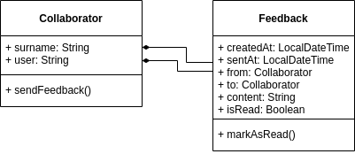

# eive-java-101

Atividades level 1 da trilha Java do Eive (:

_<div align='right'>se quiser fazer os commits em inglês para praticar, fica à vontade (seria bem maneiro, inclusive hehe)</div>_

------

<div align='justify'>

1. Crie uma pasta destinada à formação Java do Eive (seguindo boas práticas de nomenclatura, como a não utilização de espaços e acentuação) e, dentro dela, salve o arquivo `README.md`, com o seguinte conteúdo:

```
# eive-java-101
Nome: {nome_do_colaborador}
```

1. No terminal (ou Git Bash, no Windows), navegue até a pasta recém criada:
   - O comando `ls {nomeDaPasta}` lista o conteúdo de uma pasta;
   - O comando `cd {nomeDaPasta}` acessa uma pasta;
2. Já na pasta, inicialize o repositório Git;
3. Execute o comando de verificação de status do repositório para garantir que o comando anterior foi executado com sucesso;
4. Adicione o arquivo na lista de arquivos mapeados do Git e, então, commite suas alterações com a mensagem "Repositório criado.";
5. Crie um arquivo `.gitignore`, adicione-o à lista de arquivos mapeados do Git e, então, commite a nova alteração com uma mensagem dentro das boas práticas do Git (as mensagens devem ser assertivas - curtas, descritivas e bem escritas);
6. Crie, no Github, um repositório chamado `eive-java-101`, adicione-o como um repositório remoto do seu repositório local e envie os dados atuais para o mesmo;
7. Crie uma branch chamada `level-1` e, nela, altere o arquivo README.md com uma curta explicação para cada um dos comandos mostrados nos cursos `Git e Github: Controle e compartilhe seu código` e `Git e Github: Estratégias de ramificação, Conflitos e Pull Requests`;
8. Faça um commit com a alteração anterior e realize um novo push da branch atual;
9. Faça um commit com uma alteração qualquer, reverta a mesma (com o commit de reversão) e realize um novo push;
10. Crie e envie a tag `0.1.0` para o Github, ainda na branch `level-1`;
11. Realize um PR (Pull Request) da branch `level-1` para a `master`;
12. Adicione, na mesma branch, uma explicação detalhada sobre o `Git Flow` e faça o mesmo;
13. Crie uma nova branch chamada `level-1/java` e, nela, o arquivo `java_jre_jdk.md` contendo uma explicação detalhada sobre:
    - O que é Bytecode?
    - O que é JVM?
    - O que é JRE?
    - O que é JDK?
    - Quais as diferenças entre um tipo primitivo e uma classe `Wrapper`?
    - O que é e como utilizar o `Type Casting`?
    - Quando e por que utilizar o comando `break`?
14. Faça um commit com a alteração anterior e realize um novo push da branch atual;
15. Crie e envie a tag `0.2.0` para o Github, ainda na branch `level-1/java`;
16. Realize um PR da branch `level-1/java` para a branch `level-1` e, então, um PR da branch `level-1` para a branch `master`;
17. Crie um projeto Java chamado `java101-feedbox` e, nele, crie as classes como mostrado no diagrama abaixo, seguindo as regras de encapsulamento, visibilidade e construtores
    - O método `sendFeedback()` deve possuir os parâmetros `to`, do tipo `Collaborator`, e `content`, do tipo `String`, e será utilizado para instanciar um objeto do tipo `Feedback`;
    - O método `markAsRead()` deve somente alterar a flag `isRead` para verdadeiro;



</div>